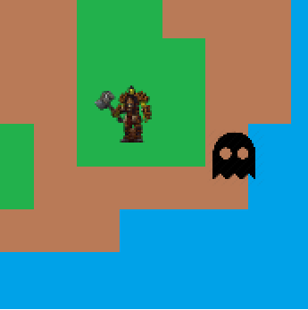

# Gra-zręcznościowa
Grę zręcznościową, w której wielowątkowość może zostać wykorzystana do jednoczesnej obsługi wielu przeciwników na ekranie.
Gra bazuje na wzorcu ecs, wzorzec wyróżnia trzy kluczowe elementy: jednostki (ang. entities), komponenty (ang. components) oraz systemy (ang. systems). Bazuje na podejściu zwanym kompozycją ponad dziedziczenie.
Program został napisany dzięki bibliotece SDL.

# Działanie
Na ekranie pojawi nam się mapa gry, po której możemy poruszać się przycisakmi wsad, pojawią się również przeciwnicy - duchy, których za wszelką cenę musimy unikać:

# Wielowątkowość
W klasie Manager plik (ECS.h) zdefiniowana jest metoda updateEntities, która aktualizuje zakres encji. Jest ona wywoływana przez metody update, które tworzą i uruchamiają wiele wątków do równoczesnego aktualizowania różnych zakresów encji.

Metoda update rozpoczyna się od uzyskania liczby dostępnych wątków za pomocą, która zwraca liczbę dostępnych wątków w systemie.

Następnie liczba encji jest podzielona równo pomiędzy dostępne wątki. Każdy wątek otrzymuje zakres encji do zaktualizowania.

Tworzone są dodatkowe wątki za pomocą konstruktora std::thread, a dla każdego wątku wywoływana jest metoda updateEntities z odpowiednim zakresem encji.

Główny wątek aktualizuje pozostałe encje, które nie zostały przypisane do innych wątków.

Po zakończeniu aktualizacji wszystkie wątki są czekane przy użyciu metody join, aby upewnić się, że wszystkie operacje zostały zakończone przed kontynuacją programu.

w kodzie użyto obiektu std::mutex w celu synchronizacji dostępu do danych współdzielonych przez wątki. W klasie Manager znajduje się obiekt std::mutex o nazwie mutex, który jest wykorzystywany do zapewnienia bezpiecznego dostępu do wektorów encji podczas aktualizacji.

W metodzie updateEntities, przed rozpoczęciem aktualizacji encji, wątek uzyskuje blokadę na mutexie przy użyciu std::lock_guard<std::mutex> lock(mutex). To zapewnia, że tylko jeden wątek może równocześnie wykonywać aktualizację encji. Po zakończeniu aktualizacji blokada zostaje automatycznie zwolniona, gdy opuszcza zakres.
